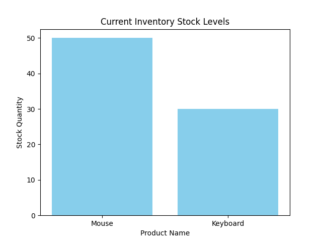

# Inventory Management & Data Analysis Project

This project provides a complete system to manage business inventory using Python and SQLite. It also includes data analysis and visualization features to track stock levels effectively.

## Features:
- **Database Management:** Uses SQLite3 for persistent data storage.
- **Data Analysis:** Utilizes Pandas to calculate total stock quantity and average pricing per category.
- **Data Visualization:** Generates bar charts using Matplotlib to visualize inventory stock levels.
- **Visual Report

## Project Structure & Usage:
1. **db_setup.py**: Run this first to initialize the database and create the inventory table.
2. **data_analysis.py**: Run this to fetch data from the database and view analytical results in the terminal.
3. **data_visualization.py**: Run this to generate a visual bar chart [Inventory Analysiis Graph] of your current stock.
** Installation
This project requires Python and some external libraries. To install them, run:
```bash
pip install pandas matplotlib
---
**Developed by:** Ratul Hasan
*Software Engineering Student, Yunnan University*
